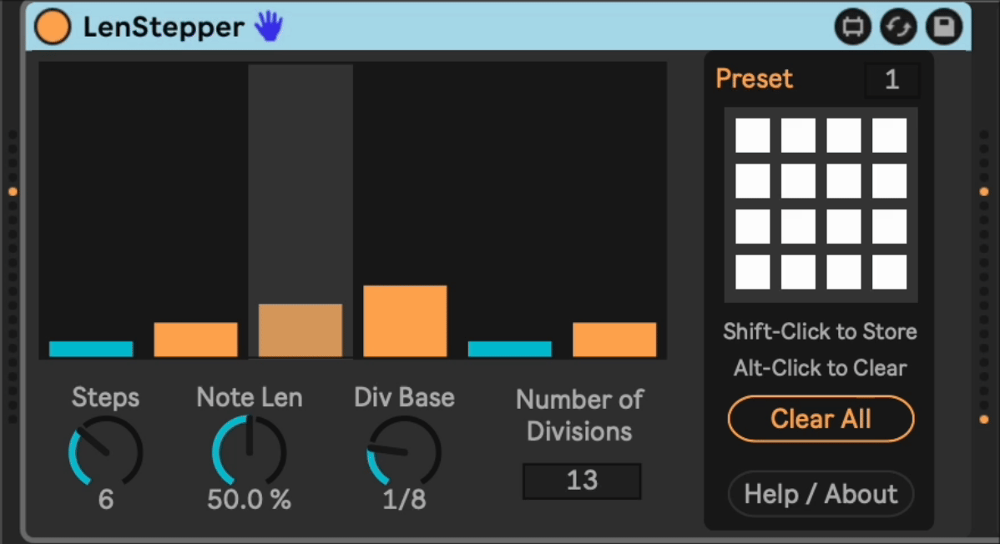

# m4l-LenStepper

## A single note arpeggiator with a step sequencer interface to note length.

This is a Max For Live step sequencer that is oriented around emitting different patterns of a note. Its main interface is to configure steps in a 1-16 step loop, where each step is a note of some number of measure divisions long.

This allows you to build interesting polyrythms and fugal melodies in
conjunction with my other device,
[KeyStepper](https://github.com/zsteinkamp/m4l-KeyStepper/). You can do this by
using a loop length and/or number of divisions that results in interesting
shifting patterns, especially if you set them using prime numbers.

The sequencer begins on note-on and stops on note-off. When beginning, it always starts from the first step.

### Changelog

Direct download links below.

- [v2](https://github.com/zsteinkamp/m4l-LenStepper/raw/main/frozen/LenStepper-v2.amxd) - 2023-11-17 - Reimplemented stuff that was javascript to native Max objects. Javascript timers are not accurate enough for music.
- [v1](https://github.com/zsteinkamp/m4l-LenStepper/raw/main/frozen/LenStepper-v1.amxd) - 2023-11-12 - Initial release.

## Installation / Setup

If you just want to download and install the device, then go to the [frozen/](https://github.com/zsteinkamp/m4l-LenStepper/tree/main/frozen) directory and download the newest .zip file there. You can also download it directly via the links in [_Changelog_](#changelog).

## Usage

Add the device to an instrument or MIDI track. Holding a note will run the LenStepper.

### Steps

Use the `Steps` dial to control the number of steps in your pattern.

### Note Length

Use the `Note Len` dial to control how long the notes emitted are relative to
the time until the next note. A value of 100% will sustain notes until the next
note plays. A value of 0% will emit very short notes, but not affect the time
the next note plays.

### Divisions

Use the `Divisions` dial to indicate how many sections to slice a measure into
divisions. For example, a value of 8 will make each division an eighth note.
Using 7 will use 1/7 notes as divisions, etc.

## Common Problems

It sometimes goes haywire if it gets more than one note-on event. If you release all notes then it will settle down.

#### ...

...

## TODOs

- ...
